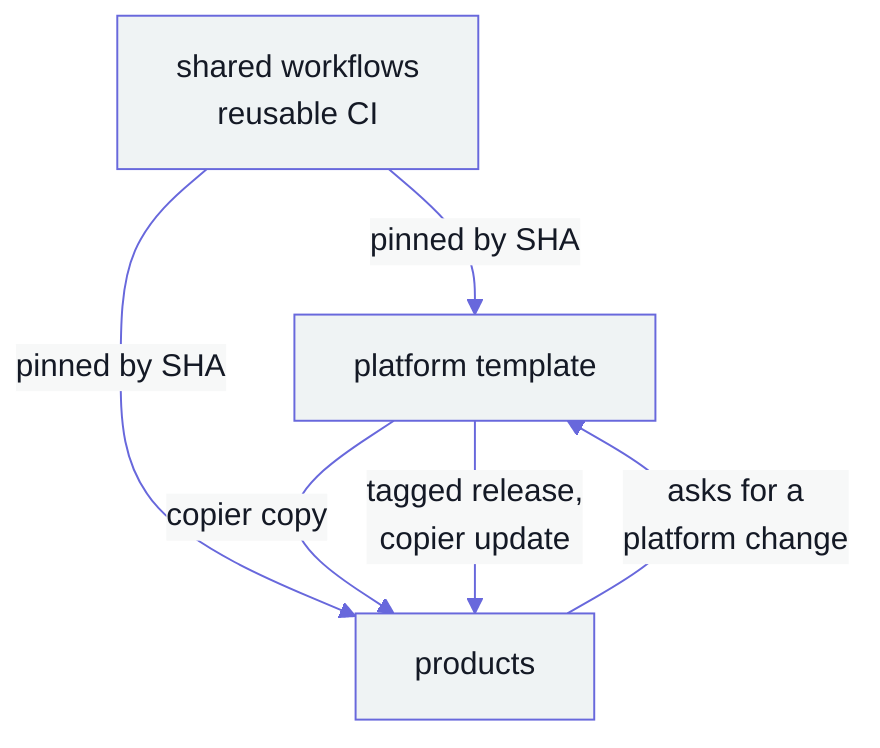

# rmartinez-labs

**A small lab that ships products on one shared platform.**

Every product starts from the same template, runs the same checks, and takes platform fixes through a release, never by copy and paste.

## How the pieces fit

*The platform owns the shared parts. A product never edits them: it asks, and the next release brings the fix.*

## What we hold ourselves to

| Rule | In practice |
|---|---|
| Pinned, and not too fresh | every action by commit SHA, every tool and image by exact version, the newest one older than seven days |
| One gate per workflow | each workflow ends in a single `<Name> (required)` check, and branch protection reads only that |
| Security in every pipeline | secret scanning, dependency and image scans and workflow linting run from one shared set of workflows on every pull request |
| Releases from commits | conventional commit titles feed release-please; nobody tags by hand |
| Review before merge | the author never approves their own change; the verdict names the commit it read |
| Measure, then explain | a stated cause comes with the command that showed it |

The repositories are private for now.
